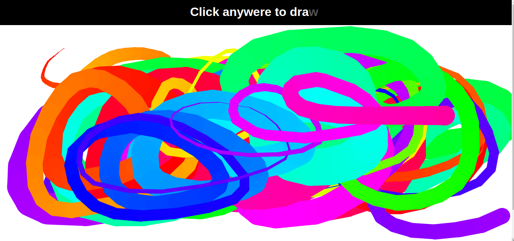

# Practice: Drawer with Javascript Canvas

This small project is part of my learning path to become a web developer. At this stage I'm learning the basic technologies of this area of programming.

This game is built with pure JS, taking inspiration and ideas from an online tutorial and adding my own functionalities.

## View

## Technologies

    - HTML
    - CSS
    - JS
